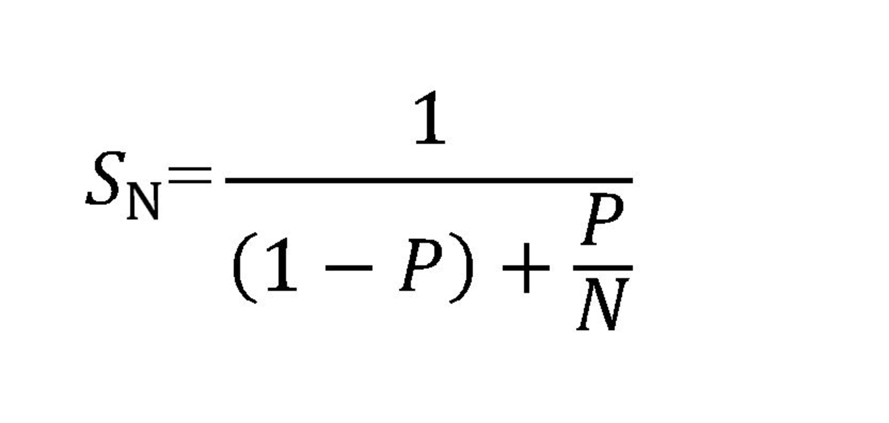

# Exam Review

The exam will cover everything from Quiz 6 onward.

<!-- ## Quiz 6 Questions

1. After this block of code runs, how many processes are sleeping?
    ```c++
    #include <unistd.h>
    int main(void) {
        fork();
        fork();
        fork();
        fork();
        sleep(1000);
        return 0;
    }
    ```
    * Answer: 16. Fork creates 2 processes, a parent, and a child, and then continues to run the program. So if our 1 program calls fork(), we now have 2. Then both of them call fork() again, so we now have 4 processes. Each of those call fork(), giving us 8, and then each of those call fork() again giving us 16. When we get to the sleep() part, we now have 16 sleepign processes.
1. What's the difference between execv() and execvp()?
    * Answer: execv() must be told where to find a program to load; execvp() will search for a program in each directory contained in the $PATH environment variable. You would pass the path to the program in execv() and just the program name in execvp().
1. What is a terminated process called before it is reaped by wait()?
    * A zombie process.
1. What does it mean for a function to "block"?
    * The calling program does not continue until execution of the blocking function completes
1. We discussed two types of shared memory buffers. What were they?
    * Bounded buffer, where buffer size is limited, and an unbounded buffer where buffersize is not limited
1. Which are the two primitive message passing operations any message-passing system must implement?
    * send() and recieve()
1. In the context of interprocess communication, what is Rendezvous?
    * When blocking send() and receive() operations cause both communicating parties to pause at known positions in their code
1. T/F Zero capacity buffers allow non-blocking operation
    * False -->

## Quiz 7

1. T/F Global variables are entirely bad
    * False. They have some use but it is best to avoid them when possible.
1. Which global variable contains the disposition of the most recent system call?
    * errno
1. Which function from the C string library can be used to "decode" the error number into a human-friendly string?
    * strerror()
1. Under normal circumstances (i.e. not an error), how many times does the fork() system call return?
    * 2
1. Under normal circumstances (i.e. not an error), how many times do members of the exec() family of system calls return?
    * 0

## Quiz 8

1. Which law helps us predict the maximum speedup possible by multiprocessing?
    * Amdahl's law
1. T/F Spawining threads incurrs less overhead than spawning child processes
    * True
1. T/F Tags in git are automatically pushed to a remote repository with the `git push` command
    * False
1. What is this file named 'core' which showed up after my program crashed?
    * It is a file which contains the memory image of a running process (stack and heap)
1. What is a file descriptor?
    * An integer which refers to a file held open by a process
1. What best practices should you follow after you create a pipe in a program?
    * Close the ends of the pipe that are unused by this program

## Quiz 9

1. Which type of parallelism involves distributing subsets of data across cores so as to do the same operations on different data?
    * Data parallelism
1. Which type of multithreading do mainstream OSes such as Linux and Windows use?
    * One-to-One
1. In which type of cancellation may one thread immediately terminate another thread?
    * Asynchronous cancellation
1. What is a critical section?
    * A segment of code in which shared resources are accessed
1. What is the output of the following program?
    ```c++
    #include <iostream>
    #include <thread>
    using namespace std;

    // The function we want to execute on the new thread.
    void task1(string msg) {
    cout << "task says: " << msg << endl;;
    }

    int main() {
    thread t1(task1, "Hello1");
    thread t2(task1, "Hello2");
    thread t3(task1, "Hello3");
    thread t4(task1, "Hello4");

    t1.join();
    t2.join();
    t3.join();
    t4.join();

    return 0;
    }
    ```
    * Since the threads are not synchronized the output may come in any order
1. Based upon our discussion of the Dining-Philosopher problem in class, given the following pseudo-code, what would be the best value for (k) to allow each Philosopher to proceed without deadlock?
    ```c++
    repeat

    wait(chopstick[i])
    wait(chopstick[(i+k) mod 5])
    .....................
    .....................
    eat
    .....................
    .....................
    signal(chopstick[i])
    signal(chopstick[(i+k) mod 5])
    .....................
    .....................
    think
    until false
    ```
    * 1

## Quiz 10

1. Which of the following are considered preemptive:
    1. When a process switches from the running to the waiting state.
    1. When a process switches from the running state to the ready state.
    1. When a process switches from the waiting to the ready state.
    1. When a process terminates
    * 2 & 3
1. T/F First-Come, First Served scheduling can result in the (mercy sakes alive) convoy effect.
    * True
1. T/F A preemptive Shortest Remaining Time First scheduling algorithm can result in starvation.
    * True
1. These processes and their associated CPU burst times have arrived in a scheduler's queue.
    ```c++
    Process
    sequence CPU Burst Time
    P1          9
    P2          2
    P3          4
    P4          3
    P5          4
    P6          10
    ```
    1. What is the average delay which would result from a First-Come First-Served scheduler?
        * 12.5
    1. What is the average delay which would result from a Shortest-Job-First scheduler?
        * 8.5

## Class Review

### Amdahl's Law

Be familliar with how to compute the maximum possible speedup given infinite CPUs.



In Amdahl's law, S_n is the theorhetical speedup that can be achieved, P is the proportion of execution time that the part benefiting from improved resources originally occupied, and N is the speedup that P gets from having better resources. This means, as you add more CPUs, N will increase to infinity, meaning (P/N) goes to zero. This means, given infinite CPUs, the maximum possible speedup is 1/(1-P).

### Models of Multithreading

* **One-to-one** - one thread in your process is equivalent to one thread in the kernel (C++)
* **Many-to-one** - many threads in your process correspond to one thread in the kernel (green threads) (Chicken Scheme)
* **Many-to-many** - Thread pool
* Which threading models are able to take full advantage of parallel hardware?
    * This would be **Many-to-many** and **One-to-one**. In One-to-one, you have one user thread corresponding to one kernel thread and you can have as many as the kernel will give you, which is where you'll run into a limit on the number of threads you can have. In Many-to-many, you have a pool of user threads, corresponding to a smaller group of kernel threads. This way you can utilize all of the kernel threads, and not have to worry about the number of threads that you can make.

### Models of Parallelism

* **Data Parallelism** - This is where you take chunks of data and split them across cores/threads to do the same operations on different sets of data.
    * ex: core1 sums the contents of arr[0] - arr[n/2] and core2 does arr[n/2 + 1] - arr[n], pixels on your screen, bitcoin
* **Task Parallelism** - This is where different threads/cores are performing different operations.
    * ex: core1 handles UI, and core2 handles 'slow' background tasks.

Generally applications will use a mix of data and task parallelism.

### Critical Sections

**Critical Sections** are a segment of code in which shared resources are accessed.

**The Critical Section Problem** is to design a protocol that your processes can use to cooperate. If you don't solve this problem, you may run into a race condition. A typical Critical section will have the following structure:

```c++
do {
    /* ENTRY SECTION */

    critical section
    ...

    /* EXIT SECTION */

    remainder section
    ...

} while (true);
```

To solve the critical section problem, you need to ensure 3 things:

1. **Mutual exclusion** If one process is executing its critical section, no other processes may be executing in their critical section
1. **Progress** If no process is in its critical section, then only those processes not in their remainder sections are considered for the choice of next entrant to the critical section
1. **Bounded waiting** There is a limit to the number of times a process is denied entry to its critical section in favor of other processes

### What is the Difference between a process and a thread?

**Process** - Single-threaded processes are those that only have one thread of control.

**Thread** - Threads are a single thread of execution within a larger process. Threads will each have their own registers and stack, but share the code, data, and files.

### How to terminate (or cancel) a thread

You have two choices when you need to terminate or cancel a thread before it gets to a nice stopping point:

**Asynchronous cancellation**: One thread immediately terminates the target thread

**Deferred cancellation**: The target thread periodically checks (possibly by looking at a global variable) whether it should terminate. Gives the target thread a chance to clean up before it quits

### Process Scheduling

**Scheduler** - A CPU scheduler is something selects a process from the processes in memory that are ready to execute

The list of processes on a system is conceptually stored in collection of
queues based on the state of the program (i.e. ready queue, I/O queue, etc.)

**First-come first-serve scheduling** - In First-come first-serve scheduling, the process that requests the CPU first is allocated the CPU first. This is generally doen with a FIFO queue.

* The average wait time for FIFO scheduling is generally pretty long.
* FIFO scheduling is also suceptible to the **convoy effect**. This is where the longest tasks are scheduled ahead of the shorter ones, which means that the shorter tasks have to wait until the longer ones are done.

**Priority scheduling** - In priority scheduling, tasks are scheduled based on the shortest expected time.

* It can be difficult to estimate the average task time in this form of scheduling
* Tasks in this form of scheduling are also suceptable to **starvation**, which is when shorter tasks are continually added so the longer tasks never get to run. A way to fix this is through **aging**, which means increasing a tasks priority as it sits in the wait queue.

**Round-Robin Scheduling** - This form of scheduling is similar to FCFS, but it uses preemption so that process switches are garunteed to happen eventually. If there are N processes in the Ready queue, then each process will get 1/N of the CPU time, spread out over chunks in the size of the system's Time Slice.

**Time Slice** -  a small unit of time which is the longest "turn" a process can take in the Running state.

If a process on the running queue doesn't make a system call (e.g. doesn't do
an I/O operation that might cause it to wait) the system preempts it when its
time slice expires, forcing it to the back of the Ready queue.

* RR drawback: Context switches are forced even when N = 1 and there is no need to share.

RR works well when the overhead of making a context switch is low. In general,
you want to scale your time slices such that they are significantly longer than
the time it takes to do a context switch; otherwise, you spend as much time
performing context switches as you do useful work.

### How to compute the average delay among scheduling algorithms

### CPU Burst / IO Cycle

Process execution consists of a cycle of CPU execution and I/O wait.

   I/O Wait -> CPU -> I/O Wait -> CPU -> I/O Wait -> CPU -> I/O Wait -> and so on.

Eventually, the final CPU burst ends with a system request to terminate execution

### Key insights:

* An I/O-bound program typically has many short CPU bursts
* A CPU-bound program might have a few long CPU bursts

This distribution can be important in the selection of an appropriate
CPU-scheduling algorithm.

### Preemption, and the opposite of preemption

There are 4 circumstances undewr which CPU-scheduling decisions may take place:

1. When a process switches from the running state to the waiting state (for
   example, as the result of an I/O request or an invocation of wait() for the
   termination of a child process)
   
   "I'm at a good stopping point"

2. When a process switches from the running state to the ready state (for
   example, when an interrupt occurs)

   "Timmy, let the other children have a turn now"

3. When a process switches from the waiting state to the ready state (for
   example, at completion of I/O)

   "Your table is ready"

4. When a process terminates

   return 0; // at the end of main

When might a process be preepted by the kernel?

In circumstances 1 & 4, there is no choice in terms of scheduling
The process has made the scheduling decision 

This situation is called "nonpreemptive" or "cooperative" scheduling. Under
this scheme once the CPU has been allocated to a process, the process keeps the
CPU until it releases the CPU either by terminating or by switching to the
waiting state.

It relies upon the processes to give up their turn on the CPU

#### nonpreemptive pro: Works on simple hardware w/o dedicated timers
#### nonpreemptive con: Bugs in programs (e.g. an inf. loop or some other bug is encountered) causes the entire system to hang


### Circumstances 2 & 3, therefore, are considered "preemptive"

This method is used by all modern mainstream server & desktop OSes.

Preemption also affects the design of the operating-system kernel. During the
processing of a system call, the kernel may be busy with an activity on behalf
of a process. Such activities may involve changing important kernel data (for
instance, I/O queues). What happens if the process is preempted in the middle
of these changes and the kernel (or the device driver) needs to read or modify
the same structure?

Chaos ensues.

#### preemptive pro: More robust against programs which don't share
#### preemptive con: Requires more a sophisticated and complicated OS
#### preemptive con: Can result in race conditions when data are shared among several processes

### Pipes

* What is a pipe?
* What are the ends for?
* Which system call creates a pipe in Unix?

int p[2];
pipe(p);

The fd in p[0] is the *INPUT* side of a pipe. I can write data into it the same
way I would write to a file.

The fd in p[1] is the *OUTPUT* end of the same pipe. I can read from it just
the same as though it were a file.

### How to use the C API for error messages

* which variable contains the error code
    * errno
* how to convert that code into a human-readable form 
    * strerror(errno)
* What is an API?
    * Library of functions that you can call, datatypes to pass back and forth, which make certain system tasks easier and convenient to the application developer.

Process states What is the Process Control Block, and what does it contain? Stack vs. Heap

